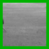
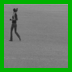

# Unofficial implementation of Video Ladder Networks

## Overview

Implementation of video prediction pipeline as [paper](https://arxiv.org/pdf/1612.01756.pdf) as a part of course project for Lab Vision Systems (MA-INF 4308). Model is evaluated on MMNIST and KTH dataset pre-trained weights for same are available

## Project Structure

```
.
├── checkpoints         # saving trained models
├── configs             # configs used for different experiments
├── data                # data directory 
│   └── KTH
│   └── MMNIST          
├── model_eval          # scripts for evaluating trained models
├── models              # building blocks of the model 
├── metrics_data        # stored data of computed metrics
├── results             # some images/GIFs computed from trained model
├── tboard_logs         # logs from our experiments
├── utils               # contains trainer to train model and some extra functionalities
└── eval.py             
└── train.py
└── summary.ipynb
```

## Installation

Please refer to [INSTALL.md](readme/INSTALL.md) for installation instructions

## Usage

First download pretrained weights for model as mentioned in above section.

Refer to this [notebook](summary.ipynb) to know about detailed usage of this repository.

## Results


**NOTE** Images padded with green are context frames, red padding indicated images predicted by our model

### Qualitative Results

MMNIST


KTH








### Quantitative Results

MMNIST


KTH


## Contact

Amit Rana (amit.rana@rwth-aachen.de), Dhagash Desai (dhagash.desai@uni-bonn.de), Lina Hashem (lina.gamal.hashem@gmail.com)


## Credits

We would like to thank [Angel Villar-Corrales](https://github.com/angelvillar96) for his guidance throughout the project.